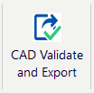
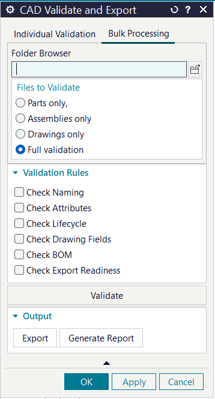
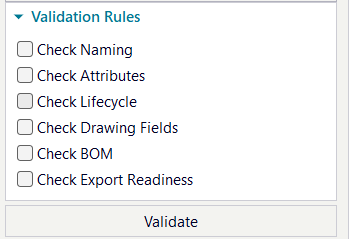
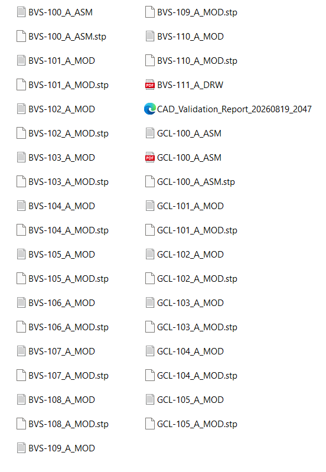

CAD Validate & Export

A Siemens NXOpen-based CAD automation plugin developed in C# to automate CAD data validation and downstream deliverable generation.

📌 Overview

CAD Validate & Export is a C# and Siemens NXOpen-based automation tool designed to reduce repetitive manual CAD verification and deliverable-generation tasks.

The application validates selected NX CAD files against predefined engineering rules and, based on the validation results, allows eligible files to proceed to automated STEP and PDF export.

The project was developed to explore practical CAD automation, engineering rule validation, CAD metadata processing, and automated deliverable generation using Siemens NXOpen.

🎯 Problem Statement

In a typical CAD environment, engineers may need to manually verify several aspects of CAD data before releasing or exporting it:

File naming conventions

Required CAD attributes

Part number and revision consistency

Document type consistency

Lifecycle status

Assembly/BOM structure

Drawing availability

Export requirements

When multiple CAD files need to be processed, performing these checks manually can become repetitive and prone to human error.

This project addresses that workflow by introducing a rule-based CAD validation and export pipeline inside Siemens NX.

🚀 Key Features

1. CAD Naming Validation

The tool validates CAD filenames against a predefined naming convention.

Current naming convention:

XXX-000_X_TYPE

Where:

XXX-000 → Part Number

X → Revision

TYPE → Document Type

Supported document types:

MOD
ASM
DRW

Examples:

ABC-101_A_MOD
ABC-101_A_ASM
ABC-101_A_DRW

The filename is parsed to extract:

Part Number

Revision

Document Type

These values are subsequently used for CAD attribute cross-validation.

2. CAD Attribute Validation

The application validates required NX user attributes based on the document type.

Different attribute requirements are defined for:

Parts (MOD)

Assemblies (ASM)

Drawings (DRW)

The validation checks include:

Required attribute existence

Blank attribute values

String attributes

Integer attributes

Part number consistency

Revision consistency

Document type consistency

Drawing number consistency

Example:

For:

ABC-101_A_MOD

the application can verify that:

PART_NUMBER = ABC-101
REVISION    = A
DOC_TYPE    = MOD

If an attribute does not match the filename, the validation result is reported as a failure.

3. Lifecycle Validation

The application provides a dedicated lifecycle validation option.

The LIFECYCLE_STATUS attribute is checked against the lifecycle states currently defined by the application.

Current accepted states:

RELEASED
APPROVED
IN_WORK

The validation identifies:

Missing lifecycle status

Blank lifecycle status

Valid lifecycle state

Unsupported lifecycle state

Example:

LIFECYCLE_STATUS = RELEASED

Result:

PASS
Valid lifecycle state: RELEASED

4. Basic BOM / Assembly Validation

The application includes basic assembly/BOM validation.

The current implementation focuses on structural assembly checks and component presence.

This provides the foundation for extending the tool with more advanced BOM validation rules in the future.

5. Basic Drawing Validation

The application includes basic drawing validation.

The current implementation checks drawing/sheet availability and provides validation results for the selected CAD files.

More advanced drawing-specific checks can be added as additional rules.

6. Batch CAD Processing

Multiple CAD files can be processed through the validation workflow.

Each file is:

Opened through NXOpen

Classified

Validated against the selected rules

Added to the validation result set

Closed after processing

This allows the tool to handle repetitive validation tasks across multiple CAD files.

7. STEP Export Automation

Validated CAD files can be passed to the export workflow for automated STEP generation.

The application uses Siemens NXOpen STEP export functionality to generate standardized CAD exchange files.

8. PDF Drawing Export

Drawing files can be exported to PDF through NXOpen.

The export workflow processes drawing sheets and generates PDF deliverables.

9. HTML Validation Report

Validation results are presented through an HTML report.

The report contains information such as:

File name

Document type

Validation rule

Validation status

Validation message

Example statuses:

PASS
FAIL
INFO

The HTML report provides a human-readable summary of the validation process.

🖥️ User Interface

The application uses the Siemens NX Block Styler framework to provide the user interface.

Main Interface

Validation Options

The user can select the required validation categories:

Naming

Attributes

Lifecycle

BOM

Drawing

🔄 Application Workflow

The overall workflow can be represented as:

                 CAD Files
                     │
                     ▼
             Select Validation
                  Options
                     │
                     ▼
              ValidatorEngine
                     │
          ┌──────────┼──────────┐
          │          │          │
          ▼          ▼          ▼
       Naming    Attributes  Lifecycle
          │          │          │
          └──────────┼──────────┘
                     │
               ┌─────┴─────┐
               ▼           ▼
              BOM       Drawing
               │           │
               └─────┬─────┘
                     ▼
            Validation Results
                     │
                     ▼
             Export Eligibility
                     │
               ┌─────┴─────┐
               ▼           ▼
             STEP         PDF
               │           │
               └─────┬─────┘
                     ▼
               HTML Report

🧠 Validation Architecture

The application follows a modular, rule-based architecture.

The ValidatorEngine acts as the orchestration layer and routes validation requests to the appropriate rule modules.

                    ValidatorEngine
                           │
          ┌────────────────┼────────────────┐
          │                │                │
          ▼                ▼                ▼
    AttributeRules    Lifecycle Check    BOMRules
          │                │                │
          └────────────────┼────────────────┘
                           │
                           ▼
                      DrawingRules
                           │
                           ▼
                  ValidationResult

This approach keeps the validation logic separated from the main processing workflow and makes it easier to add additional validation rules.

📂 Project Structure

    CAD_Validate&Export/
    │
    ├── Core/
    │   └── ValidatorEngine.cs
    │
    ├── Export/
    │   ├── ExportCandidate.cs
    │   └── ExportEngine.cs
    │
    ├── Models/
    │   ├── ValidationResult.cs
    │   └── ValidationStatus.cs
    │
    ├── Rules/
    │   ├── AttributeRules.cs
    │   ├── BOMRules.cs
    │   └── DrawingRules.cs
    │
    ├── UI/
    │   └── FinalBlockUIforValidator.cs
    │
    ├── CAD_Validate_Export.csproj
    ├── CAD_Validate_Export.sln
    └── LICENSE.txt

Core/

Contains the main validation orchestration logic.

Rules/

Contains individual validation rules for different CAD data categories.

Models/

Contains the models used to represent validation results and statuses.

Export/

Contains STEP/PDF export functionality and export-related models.

UI/

Contains the NX Block Styler user interface and UI event handling.

⚙️ Validation-to-Export Gating

One of the important workflow decisions in the project is that validation results are used to determine export eligibility.

                 Validation
                     │
                     ▼
             ┌───────────────┐
             │ Validation    │
             │    Results    │
             └───────┬───────┘
                     │
             ┌───────┴───────┐
             │               │
             ▼               ▼
           FAILED           PASSED
             │               │
             ▼               ▼
        Export Blocked    Export Candidate
                              │
                     ┌────────┴────────┐
                     ▼                 ▼
                   STEP               PDF

The objective is to prevent files that fail the required validation workflow from automatically entering the deliverable-generation process.

📊 Example Validation Results

Naming Validation

File:
ABC-101_A_MOD

Rule:
Naming

Result:
PASS

Attribute Cross-Validation

Filename:
ABC-101_A_MOD

PART_NUMBER:
ABC-101

REVISION:
A

DOC_TYPE:
MOD

Result:

PASS

Attribute Mismatch

Filename:
ABC-101_A_MOD

PART_NUMBER:
ABC-999

Result:

FAIL

PART_NUMBER (ABC-999) does not match
file name (ABC-101).

Lifecycle Validation

LIFECYCLE_STATUS:
RELEASED

Result:

PASS

Valid lifecycle state: RELEASED

📸 Validation Report

.png)

.png)

📤 Export Workflow

Once validation is completed, eligible files can proceed to the export workflow.

Supported Export Formats

Format

Purpose

STEP

CAD data exchange

PDF

Drawing/document deliverable

STEP Export

The application uses Siemens NXOpen STEP export functionality to generate STEP files.

PDF Export

The application uses Siemens NXOpen drawing/PDF functionality to generate PDF drawing deliverables.

📸 Export Output

🛠️ Technology Stack

Technology

Purpose

C#

Application and automation logic

.NET

Application framework

Siemens NXOpen

CAD automation API

NX Block Styler

User interface

Regular Expressions

Filename validation

HTML

Validation reporting

STEP

CAD exchange/export

PDF

Drawing deliverable generation

💻 Requirements

The project requires a Siemens NX development environment with NXOpen.

Required

Siemens NX

NXOpen API

Visual Studio

C#

.NET

Note: The project was developed for the author's Siemens NX development environment. NXOpen references and installation paths may need to be adjusted according to the NX version installed on the target machine.

🚀 Setup & Usage

1. Clone the Repository

git clone https://github.com/AnandNB09/CAD_Validate_Export.git

2. Open the Solution

Open:

CAD_Validate_Export.sln

using Visual Studio.

3. Configure NXOpen References

Make sure the project references the appropriate NXOpen assemblies for the Siemens NX installation being used.

The NX installation path may vary between systems and NX versions.

4. Build the Project

Build the solution in Visual Studio.

Resolve any NXOpen reference or environment-specific configuration issues before running the plugin.

5. Launch from Siemens NX

Load/run the generated plugin from the Siemens NX environment according to the configured NXOpen application deployment method.

6. Select Validation Options

Choose the validation categories required for the selected CAD files.

7. Select CAD Files

Select the CAD files that need to be validated.

8. Run Validation

The application processes the selected files and generates validation results.

9. Review Results

Review the generated validation results and identify any failed checks.

10. Export Eligible Files

Files that satisfy the required validation workflow can proceed to STEP/PDF export.

🔬 Current Validation Scope

Validation Area

Current Scope

Naming

Naming convention + parsing

Attributes

Required attributes + value checks

Attribute Cross-Check

Part number, revision, document type, drawing number

Lifecycle

Lifecycle attribute + allowed-state validation

BOM

Basic assembly/component structure validation

Drawing

Basic drawing/sheet validation

STEP Export

Automated

PDF Export

Automated

HTML Report

Automated

Batch Processing

Supported

🔮 Future Scope

The project is intentionally designed as a foundation that can be extended with additional engineering rules.

Advanced BOM Validation

Potential future enhancements include:

Recursive BOM traversal

Component quantity validation

Duplicate component detection

Missing/unresolved component detection

Component part-number validation

Revision consistency across assembly structures

Component-level attribute validation

Advanced Drawing Validation

Potential future enhancements include:

Title block validation

Drawing number validation

Revision consistency

Sheet metadata validation

Drawing/part consistency

Additional drafting-standard checks

Dimension and annotation checks

Configuration-Driven Rules

Move validation requirements and lifecycle states from hard-coded definitions into external configuration.

This would allow validation standards to be modified without changing the core application logic.

Enterprise Integration

Potential future integration areas include:

PLM systems

Teamcenter

Engineering document management systems

Enterprise CAD standards

Automated release workflows

🎓 Learning Outcomes

This project provided practical experience in:

Siemens NXOpen API

C# and .NET

CAD automation

NX Block Styler

CAD metadata handling

NX user attributes

Rule-based validation

Batch CAD processing

CAD file lifecycle handling

STEP export automation

PDF drawing export

HTML report generation

Exception handling

Resource cleanup

Modular software architecture

💡 Why This Project?

The primary objective was not simply to automate a single CAD command.

The project was developed to understand how software engineering concepts can be applied to real CAD workflows:

Engineering Rules
       +
   CAD Data
       +
 Software Logic
       +
   Automation
       ↓
Repeatable CAD Workflow

The project demonstrates an approach where CAD data can be programmatically validated before downstream deliverables are generated.

📌 Project Status

Current Status: Functional Prototype / Portfolio Project

The core validation and export workflow has been implemented.

The project is intended as a foundation for further CAD automation development, including more advanced BOM, drawing, configuration, and enterprise integration capabilities.

👨‍💻 Author

Anand Barapatre

CAD Developer | CAD Automation | NXOpen | C#

Interested in:

CAD Automation

Siemens NX / NXOpen

C# / .NET

Engineering Software Development

Parametric CAD

Design Automation

CAD Data Validation

📫 Connect With Me

LinkedIn:
https://www.linkedin.com/in/anand-barapatre-49868b239/

GitHub:
https://github.com/AnandNB09

📄 License

This project is licensed under the MIT License.

See LICENSE.txt for details.

⭐ If You Find This Project Interesting

Feel free to explore the source code and connect with me regarding CAD automation, Siemens NXOpen, engineering software development, or related opportunities.